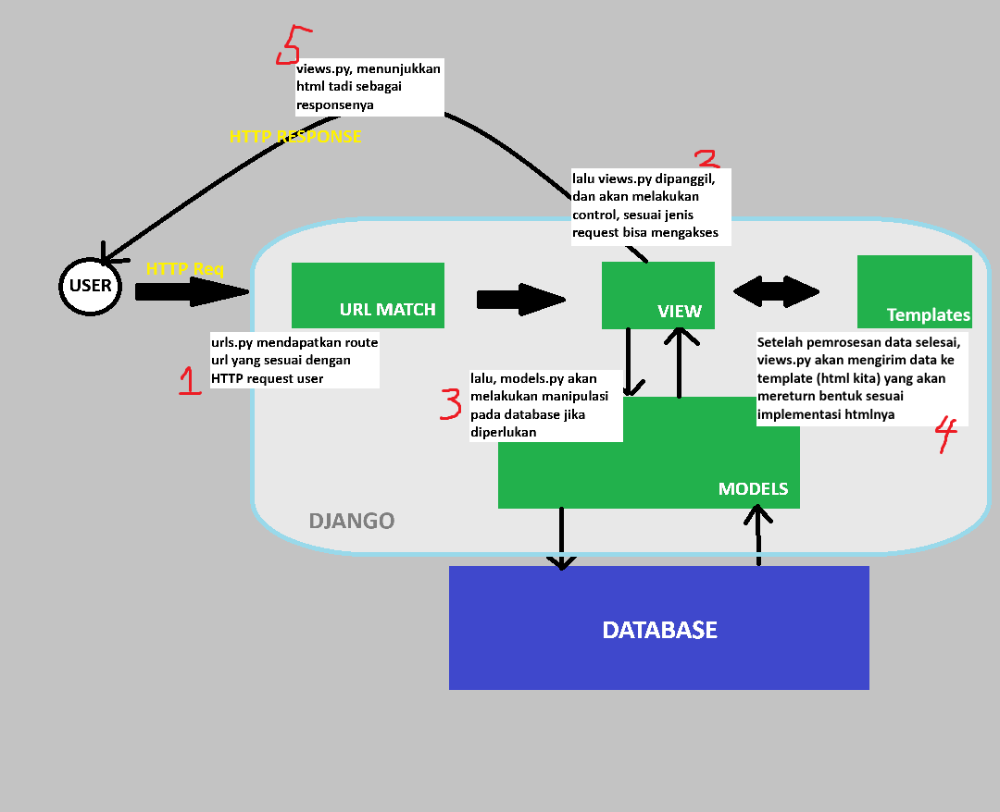
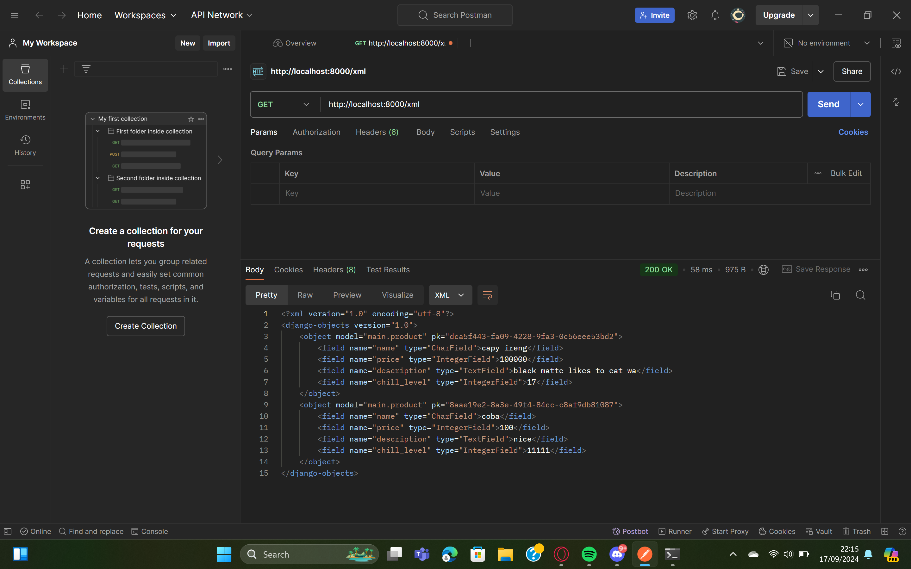
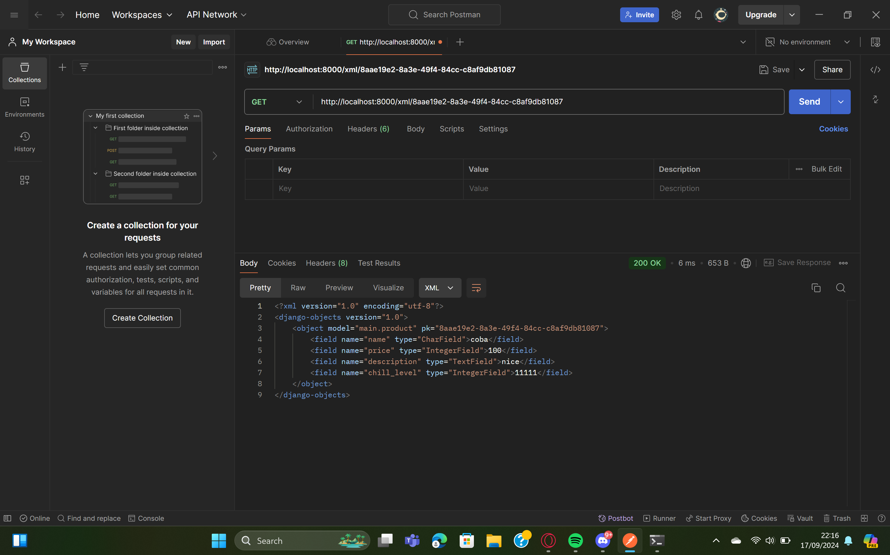
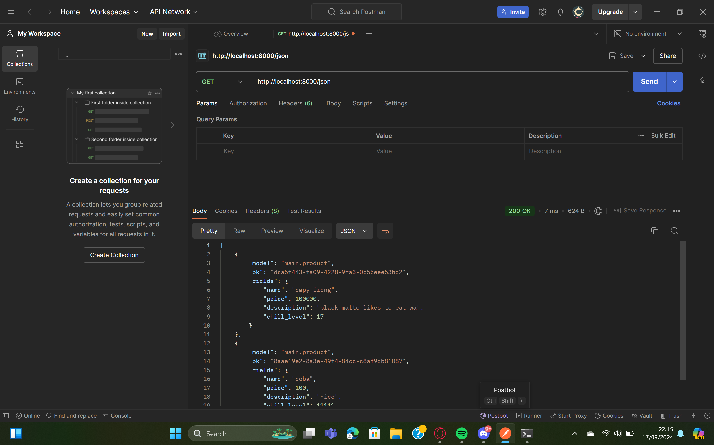
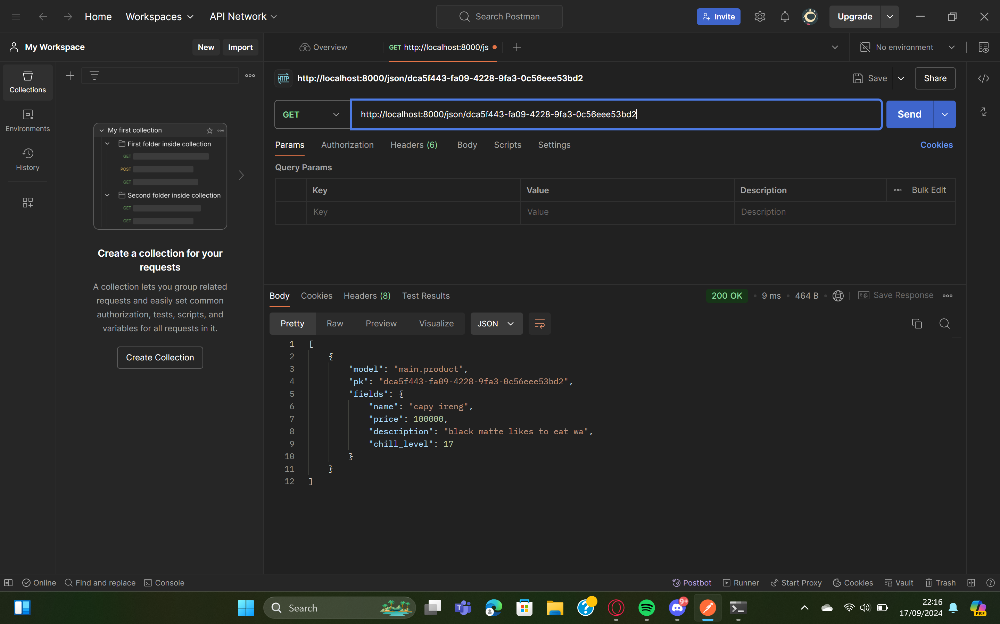

### PWS LINK: http://daffa-naufal-capybarascorner.pbp.cs.ui.ac.id ###
## Tugas 2
1. Jelaskan bagaimana cara kamu mengimplementasikan checklist di atas secara step-by-step (bukan hanya sekadar mengikuti tutorial).
2. Buatlah bagan yang berisi request client ke web aplikasi berbasis Django beserta responnya dan jelaskan pada bagan tersebut kaitan antara urls.py, views.py, models.py, dan berkas html.
3. Jelaskan fungsi git dalam pengembangan perangkat lunak!
4. Menurut Anda, dari semua framework yang ada, mengapa framework Django dijadikan permulaan pembelajaran pengembangan perangkat lunak?
5. Mengapa model pada Django disebut sebagai ORM?

========================= 1 ========================= 
- langkah paling pertama yang saya lakukan adalah menentukan nama proyek django yang akan saya lakukan, setelah itu saya buat directory nya di local file
- pada directory tersebut saya buat python virtual environment dengan command berikut ``python -m venv env``
- dalam implementasi checklist ini saya mostly lakukan dengan terminal (Powershell) dan edit file lewat VScode
- Setiap ingin mengerjakan projek django, saya tidak lupa mengaktifkan environment tadi dalam terminal saya
- Selanjutnya saya siapkan dependencies yang diperlukan dalam pembuatan proyek django, seperti menginstall library/package yang ada di file *requirements.txt* yang saya buat lewat command ``pip install -r requirements.txt``
- lalu saya buat proyek djangonya dengan command ini ``django-admin startproject capybaras_corner .``
- kemudian, dalam *settings.py* yang ada pada file proyek, saya tambahkan beberapa host seperti localhost yang bertujuan untuk mengecek proyek saya tanpa harus langsung mendeploy ke PWS
- untuk menjalankan proyek saya pada local dapat dilakukan dengan command ini ``python manage.py runserver``
- pada tahap ini dasar proyek djangonya sudah terbentuk, kemudian saya buat repository githubnya. pada direktori utama saya lakukan git init, bertujuan untuk meng-enable fungsionalitas git pada direktori tersebut
- lalu tinggal kita hubungkan repository pada github ke direktori lokal, untuk branch utamanya saya langsung namai master
- sebelum itu saya telah buat file *.gitignore*, baru saya lakukan git add, git commit, git push pertama saya dalam projek django ini
- lalu saya mulai membuat aplikasi pertama yang dinamai `main` lewat command berikut: ``python manage.py startapp main``. kemudian saya daftarkan aplikasi nya ke *settings.py* di direktori proyek
- di dalam direktori main, saya buat direktori baru bernama templates yang berisi fila html yang nantinya digunakan sebagai tampilan yang dilihat user.
- selanjutnya saya edit *models.py* aplikasi saya yang ada di direktori main. Untuk hal ini saya hanya intialize variable/atribut dasar saja (lengkap dengan fieldnya)
- setiap perubahan pada models, saya buat migrations file yang berisi perubahan itu dengan ``python manage.py makemigrations``
- kemudian, baru saya migrate berkas itu ke database dengan ``python manage.py migrate`` 
- lalu, saya hubungkan komponen *views* dengan *templates* aplikasi main, lewat mengedit file *views.py*. Dalam file tersebut saya tambahkan fungsi show_main yang berisi dictionary yang bisa digunakan dalam kode html saya, lalu saya buat hasil return nya dengan render, yang akan mengambil http request user yang lewat *views.py* akan menampilkan *main.html*
- setelah itu, saya modifikasi *main.html* nya dengan syntax python django, yang ditandai dengan ``{{ ... }}``
- kemudian, saya atur jalur URL agar aplikasinya dapat diakses lewat web browser. pengaturan url pada tingkat proyek yaitu dengan mengedit *urls.py* dalam direktori main
- kemudian tambahkan urlpatterns dari url aplikasi ke *urls.py* milik direktori proyek.
- setelah semua siap, dan direktorinya sesuai dengan yang dianjurkan saya coba commit ke github
- langkah terakhir yaitu deploy proyek django saya ke pws, pertama saya buat proyek baru dan add remote pws baru
- lalu untuk mendeploy nya saya push proyeknya ke pws dengan ``git push pws master`` (main branch saya namanya dari awal master)
- akhirnya, untuk melihat hasilnya saya bisa klik ``view project`` dalam projek di pws nya. (meskipun sejauh ini masih error, build successful tapi tidak bisa dilihat)

========================= 2 ========================= 
 
========================= 3 ========================= 
Git membantu dalam pengembangan perangkat lunak karena punya kemampuan untuk mengelola perubahan kode, membuat kolaborasi tim menjadi mudah, menghindari konflik kode, dan memastikan kode proyek selalu dapat dipulihkan. Dalam proyek besar yang dikerjakan banyak sekali programmer, git dibutuhkan agar programmernya bisa bekerja dengan lebih efisien dan teroganisir.
Berikut fungsi utama git yang membantu dalam pengembangan perangkat lunak:
- pengelolaan proyek dengan remote repository
- kemudahan kolaborasi dalam tim
- versi kontrol
- backup dan recovery data/file
- audit dan transparansi (terlihat siapa saja yang terlibat dalam pengembangan dan penulisan kodenya)
- menerapkan perubahan dengan aman (lewat pull request dan merge request)

========================= 4 ========================= 
- django menggunakan bahasa python sebagai dasarnya, yang mana dikenal sebagai bahasa pemrograman yang *newbie friendly*
- django sudah menyiapkan segala macam komponen utama yang diperlukan untuk mengembangkan aplikasi web dari awal hingga akhir
- sesuai poin sebelumnya, ini mempercepat pengembangan, yang mana kita bisa dengan cepat melihat dampak/hasil dari kode kita pada aplikasi webnya
- struktur MVT django memperkenalkan konsep yang (menurut saya) mudah diterima dalam hal pemisahan komponen logis-logisnya
- django ialah framework web yang terkenal, banyak yang memakai. sumber->[sumber](https://blog.jetbrains.com/pycharm/2024/06/the-state-of-django/#:~:text=Developing%20APIs%3A%20Most%20developers%20use,work%20among%20fully%20employed%20devs.)
- dengan banyak yang memakai, komunitas django menjadi besar dan sudah banyak programmer lain yang mungkin mengalami masalah serupa juga sudah ketemu solusinya

========================= 5 ========================= 
Model pada Django disebut sebagai ORM karena data kita dalam database ditunjukkan lewat classes dan field yang memungkinkan kita tidak perlu menulis kode query SQL. Dengan ORM, pengembang dapat memetakan struktur data dalam bahasa Python ke tabel-tabel dalam database, serta memanipulasi data tersebut.
 
## Tugas 3
1. Jelaskan mengapa kita memerlukan data delivery dalam pengimplementasian sebuah platform?
2. Menurutmu, mana yang lebih baik antara XML dan JSON? Mengapa JSON lebih populer dibandingkan XML?
3. Jelaskan fungsi dari method is_valid() pada form Django dan mengapa kita membutuhkan method tersebut?
4. Mengapa kita membutuhkan csrf_token saat membuat form di Django? Apa yang dapat terjadi jika kita tidak menambahkan csrf_token pada form Django? Bagaimana hal tersebut dapat dimanfaatkan oleh penyerang?
5. Jelaskan bagaimana cara kamu mengimplementasikan checklist di atas secara step-by-step (bukan hanya sekadar mengikuti tutorial).

========================= 1 ========================= 
Data delivery, dari pengertian namanya yaitu pengantaran data, hal itu diperlukan dalam pengembangan platform karena memungkinkan pertukaran informasi antara berbagai bagian dari sistem atau aplikasi, serta antara platform dan pengguna. Tanpa sistem pengiriman data yang efektif, sebuah platform tidak dapat berkomunikasi dengan komponen lain seperti database, UI, server, maupun layanan pihak ketiga. Data delivery juga penting untuk mendukung fitur-fitur seperti pengambilan data dari server ke browser, pemrosesan formulir, atau interaksi real-time, serta untuk integrasi sistem yang lebih luas dalam lingkungan aplikasi modern seperti microservices.

========================= 2 ========================= 
Secara umum, JSON lebih baik dibandingkan XML dalam banyak skenario, terutama untuk aplikasi web modern. Alasannya adalah sebagai berikut:
- JSON lebih ringan: JSON memiliki struktur yang lebih sederhana dan lebih ringkas dibandingkan XML, sehingga data lebih mudah dibaca dan ukuran lebih kecil, yang membuatnya **lebih cepat** untuk dikirimkan melalui jaringan.
- JSON lebih mudah dipahami: JSON berbasis objek dan memiliki format yang sangat cocok dengan sintaks JavaScript, membuatnya lebih mudah dipahami dan digunakan oleh developer yang familiar dengan JavaScript.
- Parsing lebih cepat: JSON dapat di-parse lebih cepat dibandingkan XML dalam kebanyakan bahasa pemrograman, termasuk JavaScript, karena desainnya yang sederhana.
  
XML, meskipun masih digunakan, biasanya lebih cocok untuk skenario di mana data harus sangat terstruktur atau dalam lingkungan enterprise yang memerlukan skema data yang kuat, seperti di industri yang sangat teregulasi. Namun, web modern membutuhkan pertukaran data yang efisien maka JSON menjadi pilihan yang populer. Sesungguhnya, XML lebih *versatile* dari JSON, tetapi penggunaannya dalam pengembangan platform, JSON dinilai sudah cukup.

========================= 3 ========================= 
Method is_valid() pada form Django digunakan untuk memvalidasi data yang dikirimkan melalui form. Ketika method ini dipanggil, Django akan memeriksa apakah semua field dalam form memenuhi aturan validasi yang telah didefinisikan atau telah sesuai dengan constraint yang telah diatur (misalnya, apakah format entrynya benar, apakah semua field yang wajib diisi sudah diisi, dan sebagainya). Jika semua validasi berhasil, method ini mengembalikan nilai True, yang berarti data tersebut siap untuk diproses lebih lanjut (seperti disimpan di database). Jika tidak, method ini mengembalikan False, dan Django akan memberikan pesan error terkait masalah validasi.

Kita memerlukan is_valid() untuk memastikan bahwa data yang kita terima dari pengguna tidak bermasalah atau cacat (kurang lengkap). Hal ini penting untuk mencegah penyimpanan data yang salah di database, serta menghindari potensi error atau bug yang dapat terjadi jika data yang tidak valid diproses lebih lanjut.

========================= 4 ========================= 
CSRF (Cross-Site Request Forgery) adalah jenis serangan siber di mana penyerang dapat memalsukan **request** dari pengguna yang sah ke server tanpa sepengetahuan atau persetujuan pengguna tersebut.
Django menyediakan csrf_token untuk melindungi aplikasi dari serangan ini. Token CSRF adalah token unik yang dihasilkan untuk setiap form/request dari user dan harus dikirimkan bersama form saat pengguna melakukan submit. Server kemudian memverifikasi bahwa token ini valid dan terkait dengan sesi pengguna yang sah.

Jika kita tidak menambahkan csrf_token, aplikasi kita menjadi rentan terhadap serangan CSRF. Penyerang dapat mengeksploitasi hal ini dengan mengirimkan permintaan palsu (seperti mengubah data akun atau melakukan pembelian) atas nama pengguna yang tidak menyadari bahwa mereka telah melakukan tindakan tersebut.

Contoh serangan CSRF:

Seorang pengguna login ke situs A.
Penyerang mengirimkan sebuah link berbahaya atau menyisipkan skrip di situs lain (situs B).
Ketika pengguna yang login di situs A mengklik link di situs B, situs B secara diam-diam mengirimkan permintaan POST ke situs A dengan menggunakan kredensial pengguna yang sah.
Tanpa csrf_token, server situs A tidak bisa membedakan antara permintaan yang sah dan yang dimanipulasi, sehingga tindakan yang tidak diinginkan bisa dilakukan oleh penyerang.
source: [youtube](https://youtu.be/80S8h5hEwTY?si=oquuF6UVJfi07k8C)

========================= 5 ========================= 
- Pertama kali yang saya lakukan adalah membuat template html, dimulai dari membuat direktori baru bernama templates di direktori utama, lalu saya membuat file base.html disitu. Dalam base.html berisi kode html serta DTL, penggunaannya yaitu seperti template/kerangka pada umumnya, misalnya pada file html kita yang ada dalam suatu aplikasi dapat meng-extend base.html, dan area yang kita ubah sesuka hati nantinya berada dalam tag ```` dengan ````
- Setelah itu, edit ``settings.py`` yang ada di direktori proyek. Edit pada bagian variable ``TEMPLATES``. kemudian pada ``main.html`` yang ada dalam direktori ../main/templates, update isinya dengan tujuan ``main.html`` meng-extend ``base.html`` dengan syntax DTL, dan juga buat kode original htmlnya untuk masuk diantara tag block dan endblock.
- Selanjutnya, saya mengedit models dari app main saya, yaitu menambahkan ID untuk setiap objek pada database. ID ini berasal dari library uuid. Karena models berubah, kita perlu lakukan migrasi model.
- Lalu, saya membuat sebuah file python baru bernama ``forms.py`` yang berisi kode untuk membuat form input data. Form yang dibuat akan berdasarkan models yang ada di ``main/models.py``. Kemudian, kita atur ``views.py`` yang ada di direktori main, untuk mengatur logic httprequst untuk form kita. Apabila form valid dan httprequest berupa POST maka akan redirect ke show_main. Pada fungsi ``show_main`` kita update untuk menerima entry dari form kita agar bisa mengambil seluruh objek entry form yang ada di databsae.
- Selanjutnya, kita perlu mengupdate urls aplikasi kita, dengan menambahkan path untuk fungsi form kita. Lalu, saya membuat bagian front-end untuk page formnya, tentu saja file htmlnya meng-extend base.html serta berisi kode untuk meminta input user, dalam kodenya juga ditambahkan penjelas bahwa form yang dibuat menggunakan metode POST serta ada csrf token yang digunakan sebagai pencegahan serangan CSRF. Lalu dalam ``main.html`` ditambahkan kode untuk menampilkan hasil dari input form user yang disajikan dengan tabel.
- Setelah itu, saya membuat fungsi untuk menampilkan data input form sebagai XML, JSON, serta versi dengan id spesifiknya. Menggunakan library django ``from django.http import HttpResponse`` dan ``from django.core import serializers``. Fungsi-fungsi ini berada di ``views.py`` pada main, semuanya mengambil data entry dari database dan mereturn HttpResponse dengan jenis delivery data yang sesuai (diset dengan serializers).
Untuk XML dengan ID dan JSON dengan ID kita hanya perlu menambahkan filter pada objek entry form yaitu membuat Primary Key nya yaitu id.
- Setelah membuat fungsinya di views.py, kita perlu mengatur urls.py dengan menambahkan path url pattern agar bisa diakses pengguna.
 
<h3 align="center">
Foto penggunaan POSTMAN
</h3>

 
    
    
    
    

 
## TUGAS 4 
1. apa perbedaan antara HttpResponseRedirect() dan redirect() 
Jelaskan cara kerja penghubungan model Product dengan User! 
3. Apa perbedaan antara authentication dan authorization, apakah yang dilakukan saat pengguna login? Jelaskan bagaimana Django mengimplementasikan kedua konsep tersebut. 
4. Bagaimana Django mengingat pengguna yang telah login? Jelaskan kegunaan lain dari cookies dan apakah semua cookies aman digunakan? 
5. Jelaskan bagaimana cara kamu mengimplementasikan checklist di atas secara step-by-step (bukan hanya sekadar mengikuti tutorial). 

========================= 5 ========================= 
HttpResponseRedirect	redirect()
Type	Class-based (HttpResponseRedirect)	Function-based (redirect())
URL Construction	Requires manually building the URL	Can take a URL, view name, or model instance
Flexibility	Less flexible—only works with URLs	More flexible—automatically resolves view names and model instances
Convenience	Requires more manual work	Easier and more intuitive for many use cases
Common Usage	Useful when you have a custom URL already constructed	Preferred when you want Django to resolve URLs
========================= 5 ========================= 
========================= 5 ========================= 
========================= 5 ========================= 
========================= 5 ========================= 
